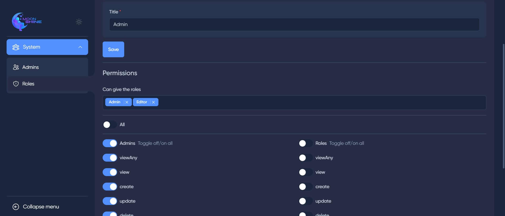

## MoonShine Roles-Permissions

### Description

This package is an extension exclusively designed for
the [MoonShine Admin Panel](https://github.com/moonshine-software/moonshine), building upon the functionality of
the [Spatie Laravel Permissions](https://github.com/spatie/laravel-permission) package. The primary purpose of this
extension is to streamline role-based access control (RBAC) within the MoonShine Admin Panel. By utilizing this package,
you can efficiently assign permissions to roles and then grant those roles to users, simplifying the process of managing
permissions on a role-based level rather than individually assigning them to each user.

---

## Features

-   [x] Role-Based Access Control (RBAC): Enhance your MoonShine Admin Panel with a comprehensive role-based permission
        system, allowing you to group users with similar permissions into roles and manage access more efficiently.
-   [x] Role Assignment: Seamlessly associate permissions with roles, making it effortless to define the access rights for
        specific groups of users.
-   [x] Bulk Role Assignment: Grant multiple users the same role simultaneously, reducing the manual effort required to
        manage permissions across large user bases.
-   [x] Seamless Integration: The package seamlessly integrates with the MoonShine Admin Panel and extends the
        capabilities of the Spatie Laravel Permissions package specifically for this panel.

---

## Important

Before using the package, it is crucial to understand that you need to use a different user model instead of "
MoonShineUser". Also, you can extend the MoonshineUser model and use the **moonshine_users table**, but you must add the
column **role_id** and specify in your new User model `protected $table = "moonshine_users"`. The package requires
the utilization of the Spatie Laravel Permission package and an empty **"moonshine_user_permissions"** table. Please
note that when the "moonshine_user_permissions" table contains other permissions for users, MoonShine Admin Panel
utilizes its internal Policy implementation, disregarding any existing Policy defined in "App/Policy."

---

## Installation

1. Install the [Spatie Laravel Permissions](https://github.com/spatie/laravel-permission) package and follow the
   instructions in the [documentation](https://spatie.be/docs/laravel-permission/v5/installation-laravel) to set up the
   package correctly.

2. Install the package via composer:

```bash
composer require sweet1s/moonshine-roles-permissions
```

3. In the MoonShine config file, change the user model to the default User model or the model you want to use for the
   admin panel.

```PHP
...
'providers' => [
    'moonshine' => [
        ...
        'model'  => \App\Models\User::class,
    ],
],
...
```

4. In the permission config file, change the models.role to App\Models\Role::class (Model need extend
   \Spatie\Permission\Models\Role), like this:

```PHP
'models' => [
    ...
    'role' => App\Models\Role::class,

],
```

5. For the user model, add the following:

```PHP
<?php

namespace App\Models;

...
use Illuminate\Database\Eloquent\Relations\BelongsTo;

use App\Models\Role;
use Spatie\Permission\Traits\HasRoles;

class User extends Authenticatable
{
    ...

    const SUPER_ADMIN_ROLE_ID = 1;

    use HasRoles;

    protected $fillable = [
        'name',
        'avatar',
        'email',
        'role_id',
        'password'
    ];

    public function role(): BelongsTo
    {
        return $this->belongsTo(Role::class);
    }

    ...
}
```

6. Run the following command to install the package and follow the installation steps:

```bash
php artisan moonshine-rbac:install
```

7. In the AuthServiceProvider.php file, add the following ( Super Admin Role ):

```PHP
...
use Illuminate\Support\Facades\Gate;

...

public function boot()
{
    ...

    Gate::before(function ($user, $ability) {
        return $user?->role?->id === config('moonshine.auth.providers.moonshine.model')::SUPER_ADMIN_ROLE_ID ? true : null;
    });
}
```

8. (Optional) Create a user with new modal and assign automatically the role "Super Admin" to it.

```bash
php artisan moonshine-rbac:user
```

9. Add new MoonShine resource to your MoonShineServiceProvider file, like this:

```PHP
MenuGroup::make('System', [
        MenuItem::make('Admins', new \Sweet1s\MoonshineRolesPermissions\Resource\UserResource(), 'heroicons.outline.users'),
        MenuItem::make('Roles', new \Sweet1s\MoonshineRolesPermissions\Resource\RoleResource(), 'heroicons.outline.shield-exclamation'),
    ], 'heroicons.outline.user-group'),
...
```

---

## Usage

1. [Creating a section in the admin panel with MoonShine](https://moonshine.cutcode.dev/section/resources-index?change-moonshine-locale=en)

```bash
php artisan moonshine:resource Post
```

_You can use the following command to generate a resource and policy at the same time:_

```bash
php artisan moonshine-rbac:resource Post
```

2. Generate a new policy for the model

```bash
php artisan moonshine-rbac:policy Post --name="PostPolicy"
```

3. For Resource, add the following:

```PHP
public static bool $withPolicy = true;
```

---

## Custom Permissions

You can simply create them in the database or by using the command
**php artisan moonshine-rbac:permissions {resourceName}**.
You can replace resourceName with any word you prefer.
For example, if resourceName is set to "Database", then 8 permissions
(view, viewAny, create, update, delete, restore, forceDelete, massDelete)
with the names resourceName.permission will be created.

---

### [Commands documentation](./.docs/Commands.md)

---

#### _How does it look in the Admin Panel ?_


