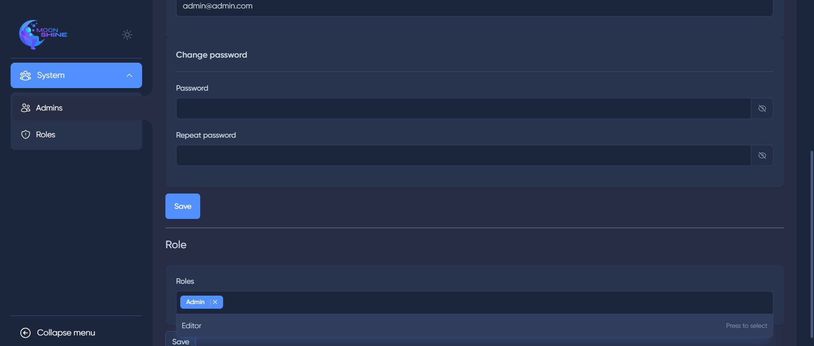

## MoonShine Roles-Permissions

### Description

This package is an extension exclusively designed for
the [MoonShine Admin Panel](https://github.com/moonshine-software/moonshine), building upon the functionality of
the [Spatie Laravel Permissions](https://github.com/spatie/laravel-permission) package. The primary purpose of this
extension is to streamline role-based access control (RBAC) within the MoonShine Admin Panel. By utilizing this package,
you can efficiently assign permissions to roles and then grant those roles to users, simplifying the process of managing
permissions on a role-based level rather than individually assigning them to each user.

<p align="center">
<a href="https://packagist.org/packages/sweet1s/moonshine-roles-permissions"></a>
<a href="https://packagist.org/packages/sweet1s/moonshine-roles-permissions"></a>
<a href="https://packagist.org/packages/sweet1s/moonshine-roles-permissions"></a>
</p>
<p align="center">
    <a href="https://laravel.com"></a>
    <a href="https://laravel.com"></a>
    <a href="https://github.com/moonshine-software/moonshine"></a>
</p>

---

> ### Requirements
> Moonshine: v2.0+
>
> Spatie Laravel Permissions: v6.0+

---

## Features

-   [x] Role-Based Access Control (RBAC): Enhance your MoonShine Admin Panel with a comprehensive role-based permission
    system, allowing you to group users with similar permissions into roles and manage access more efficiently.
-   [x] Role Assignment: Seamlessly associate permissions with roles, making it effortless to define the access rights
    for
    specific groups of users.
-   [x] Bulk Role Assignment: Grant multiple users the same role simultaneously, reducing the manual effort required to
    manage permissions across large user bases.
-   [x] Seamless Integration: The package seamlessly integrates with the MoonShine Admin Panel and extends the
    capabilities of the Spatie Laravel Permissions package specifically for this panel.

---

## Important

Before using the package, it is crucial to understand that you need to use a different user model instead
of "`MoonShineUser`" and use the table `users`. The package requires the utilization of the Spatie Laravel.

---

## Installation

1. Install the [Spatie Laravel Permissions](https://github.com/spatie/laravel-permission) package and follow the
   instructions in the [documentation](https://spatie.be/docs/laravel-permission/v6/installation-laravel) to set up the
   package correctly.

2. Install the package via composer:

```bash
composer require sweet1s/moonshine-roles-permissions
```

3. In the MoonShine config file, change the user model to the default User model or the model you want to use for the
   admin panel.

```PHP
return [
    // ...
    'auth' => [
        // ...
        'providers' => [
            'moonshine' => [
                'driver' => 'eloquent',
                'model' => \App\Models\User::class,
            ],
        ],
    ],
    // ...
];
```

4. In the `Spatie permission config file`, change the models.role to `App\Models\Role::class` (Model need extend
   \Spatie\Permission\Models\Role), like this:

```PHP
'models' => [
    // ...
    'role' => App\Models\Role::class,
],
```

5. For your Role model, add the following:

```PHP
<?php

namespace App\Models;

use Sweet1s\MoonshineRBAC\Traits\HasMoonShineRolePermissions;
use Spatie\Permission\Models\Role as SpatieRole;

class Role extends SpatieRole
{
    use HasMoonShineRolePermissions;

    protected $with = ['permissions'];
}
```

6. For the user model, add the following:

```PHP
<?php

namespace App\Models;

// ...
use Illuminate\Database\Eloquent\Relations\BelongsTo;

use Sweet1s\MoonshineRBAC\Traits\MoonshineRBACHasRoles;

class User extends Authenticatable
{
    use MoonshineRBACHasRoles;

    const SUPER_ADMIN_ROLE_ID = 1;

    // ...
}
```

7. Run the following command to install the package and follow the installation steps:

```bash
php artisan moonshine-rbac:install
```
>If the package is being installed in a project where MoonShine resources are already implemented, and you want to automatically add permissions to these resources, you need to add the WithRolePermissions attribute to the resources. [Usage](#usage)

8. (Optional) Create a user with new modal and assign automatically the role "Super Admin" to it.

```bash
php artisan moonshine-rbac:user
```

9. Add to your `RoleResource` trait `WithPermissionsFormComponent`:

```PHP
<?php

namespace App\MoonShine\Resources;

use Sweet1s\MoonshineRBAC\Traits\WithPermissionsFormComponent;
use Sweet1s\MoonshineRBAC\Traits\WithRolePermissions;

class RoleResource extends ModelResource
{
    use WithRolePermissions;
    use WithPermissionsFormComponent;

    // ...
}
```

Add to your `UserResource` trait `WithRoleFormComponent`:

```PHP
<?php

namespace App\MoonShine\Resources;

use Sweet1s\MoonshineRBAC\Traits\WithRoleFormComponent;
use Sweet1s\MoonshineRBAC\Traits\WithRolePermissions;

class UserResource extends ModelResource
{
    use WithRolePermissions;
    use WithRoleFormComponent;

    // ...
}
```

---

Or add new MoonShine resource to your MoonShineServiceProvider file, like this (you can use other UserResource):

```PHP

MenuGroup::make('System', [
    MenuItem::make('Admins', new \Sweet1s\MoonshineRBAC\Resource\UserResource(), 'heroicons.outline.users'),
    MenuItem::make('Roles', new \Sweet1s\MoonshineRBAC\Resource\RoleResource(), 'heroicons.outline.shield-exclamation'),
], 'heroicons.outline.user-group'),

```
---

## Dynamic Items on Menu

If you want to add dynamic items to the menu that depend on the role right, you just need to add an array of menus to the MenuRBAC::menu() adapter.

```PHP
protected function menu(): array
{
    return MenuRBAC::menu(
        MenuGroup::make('System', [
            MenuItem::make('Admins', new \Sweet1s\MoonshineRBAC\Resource\UserResource(), 'heroicons.outline.users'),
            MenuItem::make('Roles', new \Sweet1s\MoonshineRBAC\Resource\RoleResource(), 'heroicons.outline.shield-exclamation'),
        ], 'heroicons.outline.user-group'),

        MenuItem::make(trans('moonshine::general.orders'), new OrderResource(), 'heroicons.outline.shopping-cart')
            ->badge(function(){
                return Order::where('status', Status::Completed->name)->count();
            }),

        //...
    );
}
```


---

## Usage

1. [Creating a section in the admin panel with MoonShine](https://moonshine-laravel.com/docs/section/resources-index)

```bash
php artisan moonshine:resource Post
```

```bash
php artisan moonshine-rbac:permissions PostResource
```

_You can use the following command to generate a resource and permissions at the same time:_

```bash
php artisan moonshine-rbac:resource Post
```

2. For Resource, add the following:

```PHP
// ...
use Sweet1s\MoonshineRBAC\Traits\WithRolePermissions;

class PostResource extends ModelResource
{
    use WithRolePermissions;

    // ...
}
```

---

## Localization

The package comes with default translation files in English, Russian and Romanian. If you want to customise the
translations, you can publish
the package translation files in your project using the following command:

```bash
php artisan vendor:publish --tag=moonshine-rbac-lang
```

---

### [Commands documentation](./.docs/Commands.md)

---

#### _How does it look in the Admin Panel ?_

|                                     Role Resource                                     |                                     User Resource                                      |
|:-------------------------------------------------------------------------------------:|:--------------------------------------------------------------------------------------:|
|  |  |
